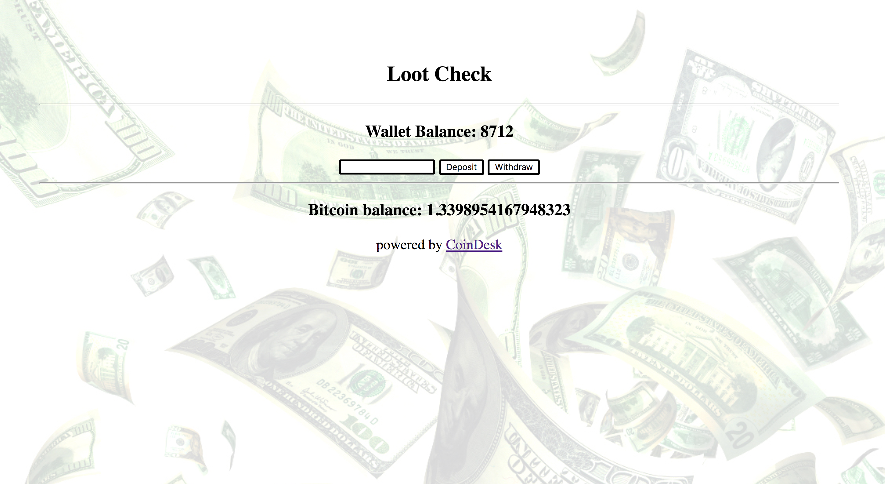

## CoinDesk BTC Price Checker - React-redux component 

This Application implements a React & Redux component tested with  Jest and Enzyme to provide functionality that interacts with the coindesk bitcoin price tracking api endpoint to show real time wallet value conversions when provided a USD amount.

### Application

### How do I try it?

1) npm install
2) npm start

### How do I see a coverage test?

1) npm run test -- --coverage

